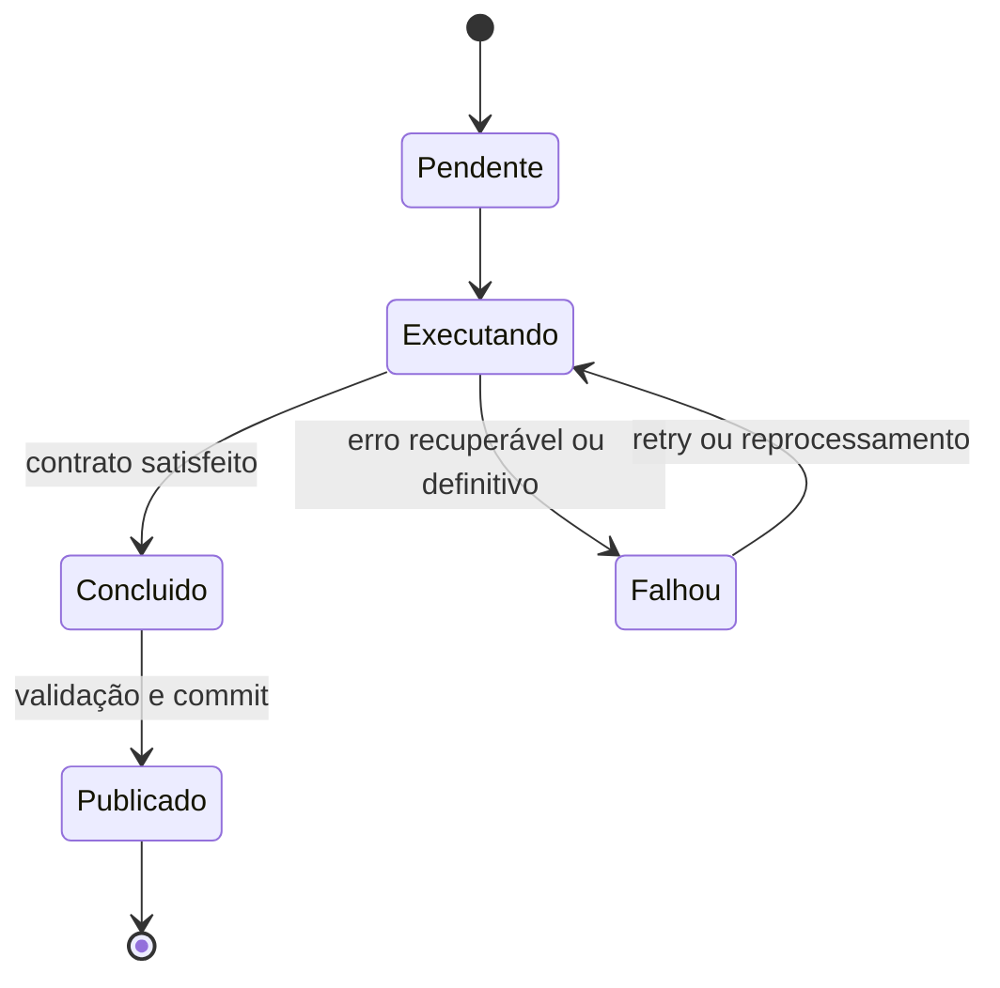

# O que é um Pipeline de Dados

Um pipeline de dados é um sistema executável que conduz dados entre estados bem definidos por meio de tarefas coordenadas, preservando contratos e registrando evidências operacionais. Ele pode transportar dados sem alterá-los, transformá-los, validá-los ou publicá-los para consumo.

## Vocabulário essencial

| Termo | Significado |
|---|---|
| Processo | transformação conceitual de uma entrada em uma saída |
| Tarefa | menor unidade operacional monitorada e repetível |
| Job | execução parametrizada de uma ou mais tarefas |
| Workflow | coordenação de atividades técnicas ou humanas |
| Pipeline | fluxo de dados executável com contratos e operação |
| Run | uma instância do pipeline para parâmetros específicos |

## Contrato de uma tarefa

Cada tarefa deve declarar entradas, saídas, parâmetros, pré-condições, efeitos colaterais e critério de sucesso. A interface pode ser expressa como:

```text
resultado = tarefa(entrada, parâmetros, estado_anterior)
```

Essa simplicidade aparente esconde decisões importantes: a saída é imutável? A escrita é atômica? O estado externo pode mudar durante um retry? Há uma chave de idempotência?

## Limites do pipeline

O início e o fim devem corresponder a responsabilidades observáveis. “Receber arquivo confirmado” é um limite melhor que “começar à meia-noite”. “Publicar partição validada” é melhor que “terminar o SQL”. O tempo pode disparar uma verificação, mas não prova disponibilidade nem correção.



> [!note]
> O pipeline é correto quando produz a saída esperada para o recorte esperado e deixa evidência suficiente para demonstrá-lo.

As tarefas isoladas ganham significado por meio de [[04-Componentes-Dependencias-e-DAGs]].
