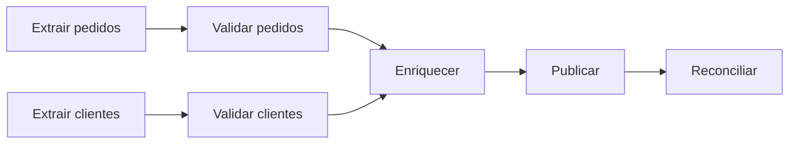

# Componentes, Dependências e DAGs

Um **DAG** (*Directed Acyclic Graph*) representa tarefas como vértices e dependências como arestas orientadas. A ausência de ciclos garante que existe ao menos uma ordenação topológica válida para a execução.



## Tipos de dependência

- **De dados:** a tarefa posterior consome a saída anterior.
- **De controle:** a posterior só pode iniciar após um evento, mesmo sem consumir a saída.
- **De partição:** apenas partições correspondentes dependem entre si.
- **De recurso:** concorrência é limitada por capacidade, quota ou lock.

Dependências de dados são mais fortes e mais fáceis de justificar. Arestas de controle sem necessidade real serializam o DAG, alongam o caminho crítico e aumentam o tempo de recuperação.

## Fan-out, fan-in e caminho crítico

No **fan-out**, uma saída alimenta tarefas independentes e paralelizáveis. No **fan-in**, múltiplas dependências convergem. O caminho crítico é a sequência de maior duração que determina a latência mínima do pipeline; acelerar tarefas fora dele pode não reduzir o tempo total.

## Ordenação topológica

O algoritmo de Kahn mantém o grau de entrada de cada vértice, executa os vértices sem predecessores e remove suas arestas. Se restarem vértices sem que exista um candidato, há um ciclo.

```python
def ordem_topologica(grafo):
    grau = {no: 0 for no in grafo}
    for destinos in grafo.values():
        for destino in destinos:
            grau[destino] += 1
    prontos = [no for no, valor in grau.items() if valor == 0]
    ordem = []
    while prontos:
        no = prontos.pop(0)
        ordem.append(no)
        for destino in grafo[no]:
            grau[destino] -= 1
            if grau[destino] == 0:
                prontos.append(destino)
    if len(ordem) != len(grafo):
        raise ValueError("O grafo contém ciclo")
    return ordem
```

> [!tip]
> Prefira tarefas coesas: pequenas o bastante para reprocessar e observar, mas grandes o bastante para que a coordenação não custe mais que o trabalho.

O grafo pode operar segundo diferentes modelos de tempo, apresentados em [[05-Batch-Streaming-e-Arquiteturas-Hibridas]].
