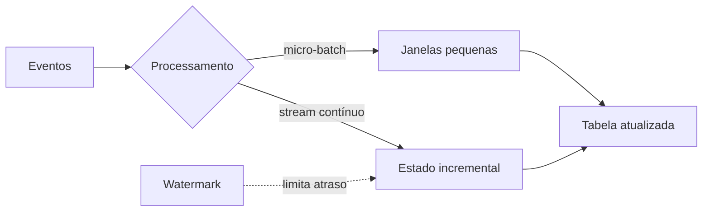

# Batch, Streaming e Arquiteturas Híbridas

**Batch** processa um conjunto limitado de dados, geralmente organizado por partição. **Streaming** trata uma sequência potencialmente ilimitada de eventos. A diferença fundamental não é apenas frequência: é a forma de delimitar trabalho, estado e completude.

| Critério | Batch | Streaming |
|---|---|---|
| Limite | conjunto ou partição | fluxo contínuo |
| Latência típica | minutos a horas | milissegundos a minutos |
| Estado | por execução/partição | contínuo e checkpointado |
| Correção tardia | reprocessamento | watermark, atualização ou retração |
| Operação | janelas de execução | serviço permanente |

## Tempo e completude

Em streaming, **event time** é quando o fato ocorreu; **processing time** é quando o sistema o observou. Eventos podem chegar fora de ordem. Uma janela agrupa eventos e o **watermark** expressa até que ponto o sistema acredita ter recebido os eventos esperados, aceitando um atraso definido.

## Escolha orientada ao requisito

Use batch quando a decisão tolera latência maior e a simplicidade reduz custo operacional. Use streaming quando o valor diminui rapidamente com atraso e a organização consegue operar estado contínuo. Uma arquitetura híbrida pode ingerir continuamente e consolidar em batch, ou reutilizar a mesma lógica em modos diferentes.

Arquiteturas Lambda mantêm caminhos batch e speed separados, o que amplia a complexidade. Arquiteturas Kappa favorecem um log reprocessável e uma única lógica de streaming. Nenhum rótulo substitui a análise de latência, correção, replay, custo e maturidade operacional.

> [!warning]
> Executar um job batch a cada minuto não elimina limites de concorrência, atraso da fonte ou custo de inicialização; apenas reduz o intervalo do agendamento.

Depois de escolher o modelo, é necessário coordená-lo em [[06-Orquestracao-Agendamento-e-Backfill]].
