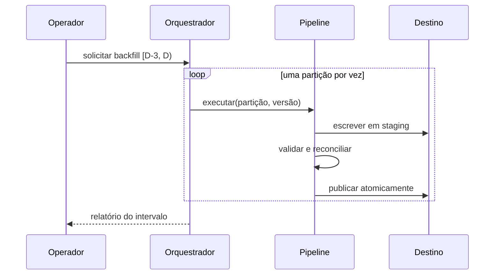

# Orquestração, Agendamento e Backfill

Orquestração coordena tarefas e políticas; processamento executa o trabalho sobre os dados. Um orquestrador registra runs, resolve dependências, distribui tarefas, limita concorrência e trata falhas, mas deve delegar transformações intensivas aos motores apropriados.

## Formas de disparo

- **Tempo:** calendário ou expressão cron.
- **Evento:** chegada confirmada de arquivo ou mensagem.
- **Dados:** atualização de um dataset ou partição.
- **Manual/API:** manutenção, recuperação ou operação assistida.

O agendamento deve produzir um intervalo lógico, como `[início, fim)`, e não depender do relógio consultado dentro de cada tarefa. Isso torna execuções passadas reproduzíveis.

```text
pipeline --data-inicio 2026-07-15 --data-fim 2026-07-16
```

## Políticas operacionais

Retries devem atender falhas transitórias, com espera exponencial e jitter. Timeout interrompe tarefas que perderam progresso. Pools limitam concorrência contra bancos e APIs. Falhas permanentes, como schema incompatível, devem interromper cedo e produzir diagnóstico claro.

## Catchup e backfill

**Catchup** cria automaticamente runs não executadas desde uma referência. **Backfill** reprocessa deliberadamente um intervalo histórico. Um backfill seguro exige:

1. código e parâmetros versionados;
2. origem histórica disponível;
3. tarefas idempotentes;
4. limites de concorrência;
5. validação antes da publicação;
6. isolamento entre histórico e carga corrente.



> [!note]
> Scheduler decide **quando considerar** uma execução; sensores e contratos determinam **se os dados estão prontos**.

A repetição segura depende das propriedades de [[07-Estado-Confiabilidade-e-Idempotencia]].
