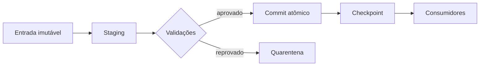

# Estado, Confiabilidade e Idempotência

Estado informa qual recorte foi tentado, concluído, validado e publicado. Ele pode residir no orquestrador, em checkpoints, tabelas de controle ou metadados do destino. O estado operacional não substitui o estado dos dados: uma tarefa marcada como concluída ainda pode ter publicado uma saída incompleta.

## Idempotência

Uma operação é idempotente quando repeti-la com a mesma entrada e parâmetros produz o mesmo estado observável. Estratégias comuns incluem:

- sobrescrever uma partição determinística;
- usar `MERGE` ou upsert por chave estável;
- deduplicar por chave de evento;
- gravar em staging e trocar o ponteiro atomicamente;
- registrar uma chave de idempotência antes do efeito externo.

```sql
INSERT INTO pedidos (pedido_id, status, valor)
VALUES ('p-100', 'confirmado', 90.00)
ON CONFLICT (pedido_id) DO UPDATE
SET status = EXCLUDED.status,
    valor = EXCLUDED.valor;
```

## Semânticas de entrega

**At-most-once** pode perder dados, mas evita repetição. **At-least-once** repete a entrega até confirmação e exige deduplicação. **Exactly-once** é uma propriedade de ponta a ponta, limitada a fronteiras transacionais bem definidas; não nasce de uma opção isolada do broker.

## Recuperação

Checkpoints reduzem o trabalho perdido. Registros venenosos devem ir para quarentena com causa e contexto, não ser descartados silenciosamente. Para efeitos externos não transacionais, uma ação compensatória pode desfazer logicamente um passo já confirmado.



> [!warning]
> Retry sem idempotência converte uma falha transitória em duplicação persistente.

Confiabilidade precisa ser demonstrada por [[08-Observabilidade-Qualidade-e-SLOs]].
