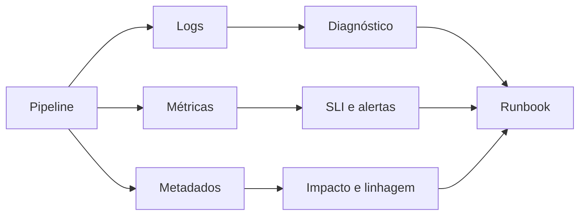

# Observabilidade, Qualidade e SLOs

Observabilidade permite explicar o estado interno por sinais externos. Em pipelines, ela reúne telemetria operacional e evidências sobre os dados.

| Dimensão | Exemplos |
|---|---|
| Execução | duração, fila, retries, taxa de falha |
| Freshness | atraso entre evento, ingestão e publicação |
| Completude | registros esperados versus recebidos |
| Volume | contagem e bytes por partição |
| Distribuição | nulos, quantis, cardinalidade e anomalias |
| Schema | campos, tipos e compatibilidade |
| Linhagem | origem, transformações e consumidores |

Logs devem conter `run_id`, tarefa, partição, versão e causa. Métricas sustentam tendências e alertas. Traces conectam a latência entre componentes. Metadados e linhagem respondem quais produtos foram afetados.

## SLI, SLO e orçamento de erro

Um **SLI** é uma medida, como percentual de partições publicadas até 08h. Um **SLO** define a meta, por exemplo 99,5% em 30 dias. O orçamento de erro é a indisponibilidade tolerada e orienta a prioridade entre confiabilidade e novas mudanças.

```text
SLI_freshness = partições publicadas no prazo / partições esperadas
SLO_freshness = SLI_freshness >= 99,5% em janela de 30 dias
```

Alertas devem indicar impacto e ação, não apenas que uma CPU subiu. Um runbook útil contém hipótese inicial, consultas de diagnóstico, critérios de retry, procedimento de backfill, escalonamento e validação final.



> [!tip]
> Alerte sobre sintomas percebidos pelo consumidor e use métricas internas para diagnosticar a causa.

O desenho operacional se completa em [[09-Seguranca-Desempenho-Custo-e-Evolucao]].
