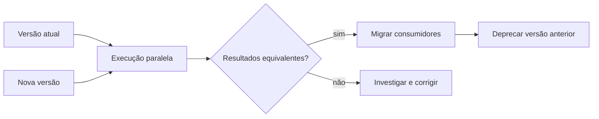

# Segurança, Desempenho, Custo e Evolução

Pipelines conectam sistemas e, por isso, ampliam superfícies de acesso. Cada tarefa deve usar identidade própria, menor privilégio, credenciais temporárias quando possível e segredos fora do código e dos logs. Dados sensíveis exigem criptografia, mascaramento, retenção e auditoria coerentes com sua classificação.

## Desempenho e capacidade

Antes de adicionar recursos, localize o gargalo: leitura, serialização, rede, shuffle, escrita ou coordenação. Particionamento e paralelismo precisam respeitar limites do destino. Mil tarefas simultâneas não ajudam se todas disputam dez conexões do banco.

O caminho crítico orienta otimizações de latência. Para throughput, meça registros ou bytes por unidade de tempo. Para estabilidade, observe backlog e utilização durante picos.

## Custo

O custo inclui computação, armazenamento, transferência, licenças e operação humana. Reprocessamentos frequentes, pequenas tarefas e retenção indiscriminada podem superar o custo da carga corrente. Associe custo a pipeline, partição, ambiente e produto de dados.

## Evolução sem ruptura

Contratos e schemas devem ser versionados. Mudanças aditivas costumam ser compatíveis; remoções, renomes e alterações semânticas exigem migração. Uma implantação segura pode usar execução paralela, comparação de resultados e troca gradual de consumidores.

> [!note]
> A melhor otimização preserva o contrato. Uma execução mais rápida que entrega dados semanticamente diferentes é uma regressão.

Essas decisões serão combinadas em [[10-Estudo-de-Caso-DataRetail]].
