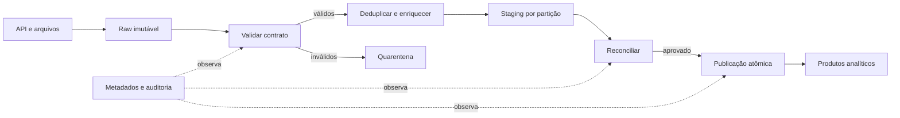

# Estudo de Caso — Pipeline de Pedidos da DataRetail

A DataRetail S.A. recebe pedidos de lojas e comércio eletrônico. A diretoria precisa de dados conciliados até 08h, enquanto a operação acompanha atualizações recentes durante o dia.

## Requisitos

- preservar eventos brutos para replay;
- publicar somente partições validadas;
- tolerar eventos repetidos e atrasados;
- isolar registros inválidos em quarentena;
- reprocessar sete anos de histórico sem interromper o fluxo diário;
- alcançar SLO de freshness de 99,5% em 30 dias.

## Desenho

O fluxo intradiário ingere eventos continuamente e atualiza uma visão operacional. O fechamento diário consolida as partições, reconcilia contagens e valores e publica o resultado analítico. Ambos usam a mesma chave de pedido e regras de negócio versionadas.

## Decisões operacionais

1. cada run recebe intervalo lógico e versão do código;
2. eventos são deduplicados por `pedido_id` e versão;
3. carga no destino usa upsert e commit após validação;
4. retries atendem apenas erros transitórios;
5. o backfill usa pool separado e menor prioridade;
6. divergência financeira interrompe a publicação;
7. alertas apontam partição, impacto e runbook.

## Cenário de falha

Uma loja reenviou o mesmo arquivo após timeout. A ingestão registrou dois recebimentos, mas a chave de evento impediu duplicação. Quando a reconciliação encontrou valor diferente do controle da loja, a partição permaneceu em staging e o produto anterior continuou disponível. Após corrigir a regra, a equipe reexecutou somente a partição afetada.

> [!example]
> O caso demonstra que confiabilidade combina fonte reprocessável, idempotência, publicação atômica, reconciliação e observabilidade; nenhum desses controles resolve o problema sozinho.

Consolide os conceitos em [[11-Resumo]].
