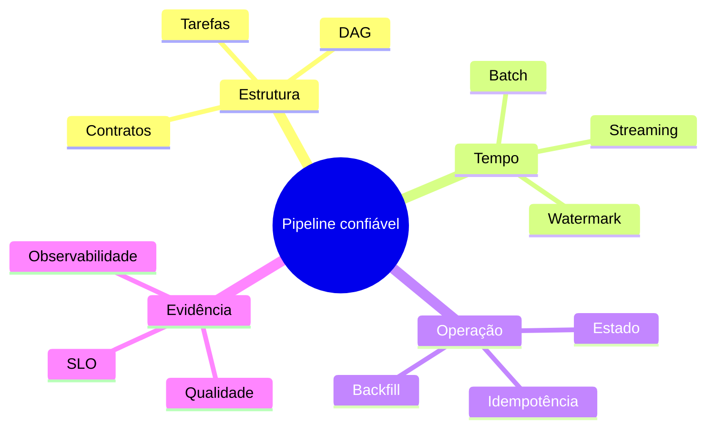

# Resumo

- Pipeline é um sistema executável de tarefas, contratos, dependências, estado e políticas.
- O plano de controle coordena; o plano de dados processa.
- DAGs tornam dependências explícitas e permitem uma ordenação topológica.
- Batch delimita conjuntos; streaming opera fluxos contínuos e estado durável.
- Event time, janelas e watermarks tratam atraso e desordem.
- Orquestração inclui gatilhos, retries, timeout, concorrência e registro de runs.
- Backfill requer parâmetros reproduzíveis, isolamento e publicação validada.
- Idempotência torna retries e reprocessamentos seguros.
- Exactly-once precisa ser analisado de ponta a ponta.
- Observabilidade combina sinais operacionais, qualidade, metadados e linhagem.
- SLI e SLO traduzem expectativas do consumidor em medidas operacionais.
- Segurança, custo e evolução são propriedades do desenho, não etapas finais.

Teste sua compreensão em [[12-Perguntas-de-Entrevista]] e [[13-Exercicios]].
