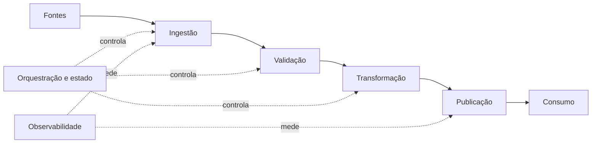

# Módulo 07 — Pipelines de Dados

> [!abstract]
> Um pipeline transforma dependências, contratos e políticas operacionais em um fluxo executável. Seu valor não está apenas em mover dados, mas em produzir resultados corretos, observáveis e recuperáveis.

## Estrutura

- [[01-Objetivos]]
- [[02-Introducao]]
- [[03-O-que-e-um-Pipeline-de-Dados]]
- [[04-Componentes-Dependencias-e-DAGs]]
- [[05-Batch-Streaming-e-Arquiteturas-Hibridas]]
- [[06-Orquestracao-Agendamento-e-Backfill]]
- [[07-Estado-Confiabilidade-e-Idempotencia]]
- [[08-Observabilidade-Qualidade-e-SLOs]]
- [[09-Seguranca-Desempenho-Custo-e-Evolucao]]
- [[10-Estudo-de-Caso-DataRetail]]
- [[11-Resumo]]
- [[12-Perguntas-de-Entrevista]]
- [[13-Exercicios]]
- [[13-Gabarito]]
- [[14-Laboratorio]]
- [[14-Solucao]]
- [[15-Referencias]]

## Projeto integrador

A DataRetail S.A. projetará um pipeline de pedidos com dependências explícitas, quarentena, carga idempotente, reconciliação e trilha de auditoria.
