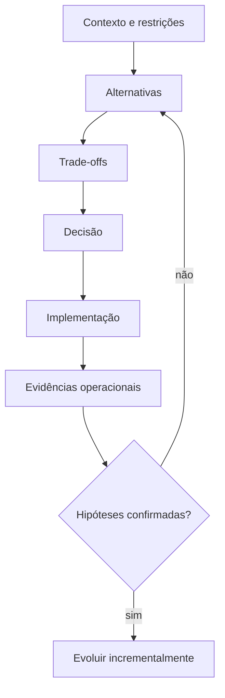

# Introdução

Sistemas de dados crescem por decisões acumuladas. Uma nova fonte, um relatório urgente ou uma exigência regulatória pode parecer local, mas altera fluxos, responsabilidades, custos e riscos. Arquitetura existe para orientar essas mudanças sem depender de improvisação contínua.

Um diagrama não é a arquitetura inteira. Ele é uma representação parcial de decisões, restrições e relações. A arquitetura também inclui contratos, princípios, responsabilidades, modelos de segurança, políticas operacionais e mecanismos de evolução.

## Escalas de decisão

- **Empresarial:** princípios, domínios, dados mestres e interoperabilidade.
- **Plataforma:** serviços compartilhados, armazenamento, processamento e metadados.
- **Solução:** desenho de um produto, pipeline ou caso de uso.

Decisões em escalas diferentes precisam ser coerentes, mas não idênticas. Um padrão corporativo deve permitir exceções justificadas quando requisitos locais realmente diferirem.

> [!warning]
> Começar pelo produto de um fornecedor transforma limitações da ferramenta em requisitos fictícios. Comece pelo problema e pelas propriedades necessárias.

O próximo capítulo define [[03-O-que-e-Arquitetura-de-Dados]].
