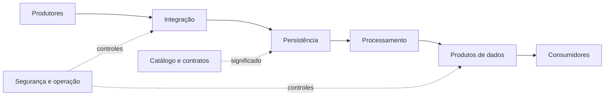

# O que é Arquitetura de Dados

Arquitetura de dados é o conjunto de estruturas e decisões significativas que determina como dados são produzidos, integrados, armazenados, protegidos, processados e consumidos. Uma decisão é arquitetural quando tem impacto amplo, custo relevante de mudança ou influência duradoura sobre atributos de qualidade.

## Perspectivas complementares

| Perspectiva | Pergunta central |
|---|---|
| Negócio | qual capacidade ou decisão será habilitada? |
| Informação | qual significado, domínio e ciclo de vida dos dados? |
| Aplicação | quais serviços produzem e consomem os dados? |
| Tecnologia | quais mecanismos executam e persistem os fluxos? |
| Operação | como detectar, recuperar e evoluir o sistema? |

## Estrutura, comportamento e implantação

A visão estrutural mostra componentes e dependências. A comportamental mostra interações e sequência. A de implantação mostra ambientes, redes e fronteiras físicas. Uma única “caixa com setas” raramente responde às três perspectivas.

## Arquitetura e design

A fronteira é contextual. Escolher isolamento entre domínios pode ser arquitetura; escolher o nome de uma função costuma ser design. Quando uma escolha afeta muitas equipes, restringe alternativas futuras ou é difícil de reverter, ela merece tratamento arquitetural.

> [!note]
> Arquitetura não elimina mudanças. Ela reduz mudanças acidentais e torna as mudanças necessárias mais seguras.

Uma arquitetura só pode ser avaliada à luz de [[04-Principios-Requisitos-e-Trade-offs]].
