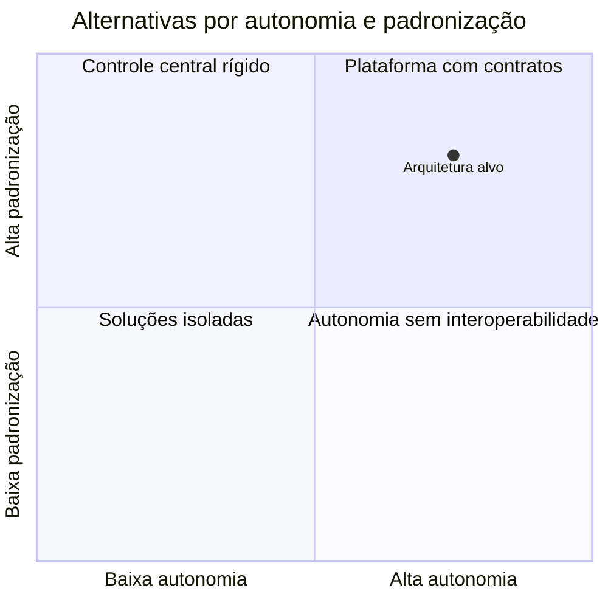

# Princípios, Requisitos e Trade-offs

Princípios orientam decisões recorrentes, como “dados brutos devem ser reprocessáveis”. Requisitos descrevem resultados necessários. Restrições limitam alternativas, como legislação, orçamento, prazo ou tecnologia já contratada.

## Atributos de qualidade

- disponibilidade e recuperabilidade;
- desempenho, throughput e latência;
- escalabilidade e elasticidade;
- segurança, privacidade e auditabilidade;
- interoperabilidade e portabilidade;
- manutenibilidade e evolutividade;
- consistência, freshness e qualidade dos dados;
- eficiência de custo.

Requisitos devem incluir cenário, estímulo, resposta e medida. “O sistema deve ser rápido” é vago. “Pedidos confirmados devem estar consultáveis em até cinco minutos no percentil 99” é testável.

```text
Quando um evento válido for confirmado,
o produto operacional deve refletir a mudança
em até 5 minutos no p99, durante horário comercial.
```

## Trade-offs

Particionamento aumenta paralelismo, mas amplia metadados e risco de arquivos pequenos. Replicação melhora disponibilidade e leitura, mas aumenta custo e complexidade de consistência. Centralização uniformiza controles, mas pode criar filas; autonomia acelera domínios, mas exige contratos e governança federada.



> [!tip]
> Toda proposta deve explicitar o atributo favorecido, o custo assumido e a condição que invalidaria a escolha.

Os requisitos ganham forma por meio de [[05-Estilos-Camadas-e-Componentes]].
