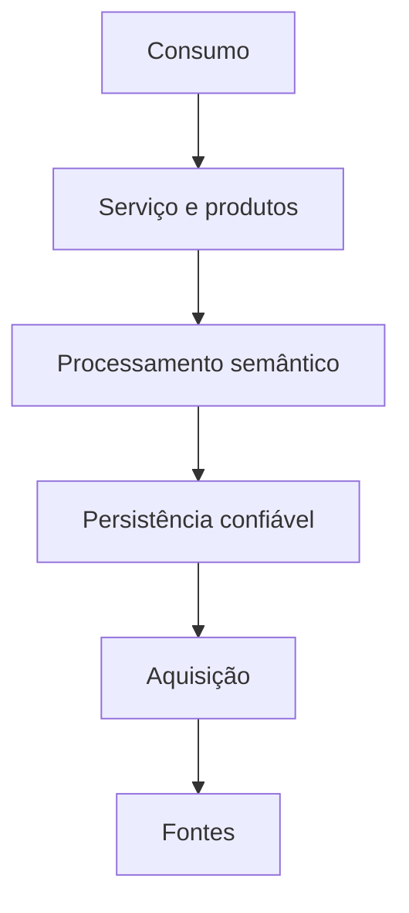

# Estilos, Camadas e Componentes

Um estilo arquitetural impõe uma forma recorrente de organizar responsabilidades e interações. Ele restringe opções para obter propriedades desejadas. Sistemas reais combinam estilos em diferentes fronteiras.

## Arquitetura em camadas

Camadas separam responsabilidades e limitam dependências. Em dados, é comum distinguir aquisição, persistência, processamento, serviço e consumo. Uma camada deve representar um contrato e uma responsabilidade, não apenas uma pasta com nome diferente.

## Outros estilos

| Estilo | Força | Cuidado |
|---|---|---|
| Pipes and filters | composição e reprocessamento | contratos entre etapas |
| Orientado a eventos | desacoplamento temporal | duplicação, ordem e observabilidade |
| Microsserviços | autonomia por capacidade | dados distribuídos e operação |
| Shared-nothing | escala horizontal | particionamento e redistribuição |
| Hexagonal | isolamento de domínio | disciplina de interfaces |

## Coesão e acoplamento

Componentes coesos concentram uma responsabilidade. Acoplamento pode ocorrer por schema, tempo, protocolo, implantação ou semântica. APIs e filas reduzem certos acoplamentos, mas não removem dependência do significado compartilhado.

Interfaces precisam declarar contrato, versão, identidade, limites, comportamento de falha e nível de serviço. Dependências devem apontar para abstrações estáveis e respeitar a propriedade do domínio.

> [!warning]
> Muitas camadas sem diferença de contrato apenas multiplicam cópias, latência e pontos de falha.

O estilo temporal é aprofundado em [[06-Arquiteturas-Batch-Streaming-e-Orientadas-a-Eventos]].
