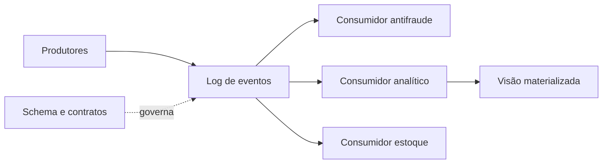

# Arquiteturas Batch, Streaming e Orientadas a Eventos

Arquiteturas batch delimitam trabalho em conjuntos finitos. Arquiteturas streaming mantêm processamento e estado contínuos. Arquiteturas orientadas a eventos conectam produtores e consumidores por fatos publicados, que podem ser processados em qualquer dos dois modos.

## Evento não é comando

Um evento registra algo que ocorreu, como `PedidoConfirmado`. Um comando solicita uma ação, como `ConfirmarPedido`. Eventos devem carregar identidade, tempo, versão do schema, origem e chave de correlação.

```json
{
  "event_id": "evt-901",
  "event_type": "PedidoConfirmado",
  "occurred_at": "2026-07-16T13:20:00Z",
  "schema_version": 2,
  "pedido_id": "p-100"
}
```

## Log, estado e materialização

Um log durável preserva a sequência de fatos. Consumidores mantêm offsets ou checkpoints e constroem visões materializadas. Reprocessamento exige retenção, schemas compatíveis e efeitos idempotentes.



## Lambda, Kappa e abordagem híbrida

Lambda separa caminhos batch e speed e combina resultados, pagando o custo de duas lógicas. Kappa privilegia um log reprocessável e uma única lógica contínua. Uma solução pragmática pode ingerir eventos, servir necessidades imediatas e consolidar resultados em batch, compartilhando contratos e regras.

> [!note]
> Event-driven não significa ausência de coordenação. Schemas, chaves, políticas de retenção e propriedade exigem governança explícita.

Para necessidades analíticas, compare [[07-Arquiteturas-Analiticas-Warehouse-Lake-e-Lakehouse]].
