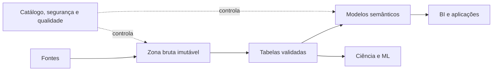

# Arquiteturas Analíticas — Warehouse, Lake e Lakehouse

Data Warehouse, Data Lake e Lakehouse são padrões com objetivos e mecanismos diferentes. Eles podem coexistir; a escolha não precisa substituir toda a plataforma.

| Aspecto | Data Warehouse | Data Lake | Lakehouse |
|---|---|---|---|
| Foco | análise governada | armazenamento flexível | análise sobre armazenamento aberto |
| Dados | estruturados e modelados | múltiplos formatos | tabelas e arquivos com metadados |
| Schema | predominantemente na escrita | frequentemente na leitura | contratos na escrita e leitura |
| Transações | nativas | dependem da implementação | camada de tabela transacional |
| Consumo | BI e SQL | ciência, exploração e arquivo | SQL, BI, ciência e ML |

## Data Warehouse

Integra dados orientados a assuntos, históricos e modelados para decisão. Entrega semântica estável, desempenho previsível e governança forte, mas pode receber novos dados mais lentamente quando processos são rígidos.

## Data Lake

Preserva dados estruturados e não estruturados em armazenamento escalável. Sem catálogo, contratos, qualidade e gestão do ciclo de vida, degrada para um conjunto opaco de arquivos.

## Lakehouse

Acrescenta metadados transacionais, evolução de schema, snapshots e otimizações a arquivos em armazenamento de objetos. O formato aberto reduz acoplamento, mas a interoperabilidade real deve ser testada entre motores.

> [!warning]
> “Schema on read” não significa ausência de schema; significa transferir parte da interpretação para o momento da leitura.

A organização da responsabilidade é discutida em [[08-Descentralizacao-Data-Mesh-e-Data-Fabric]].
