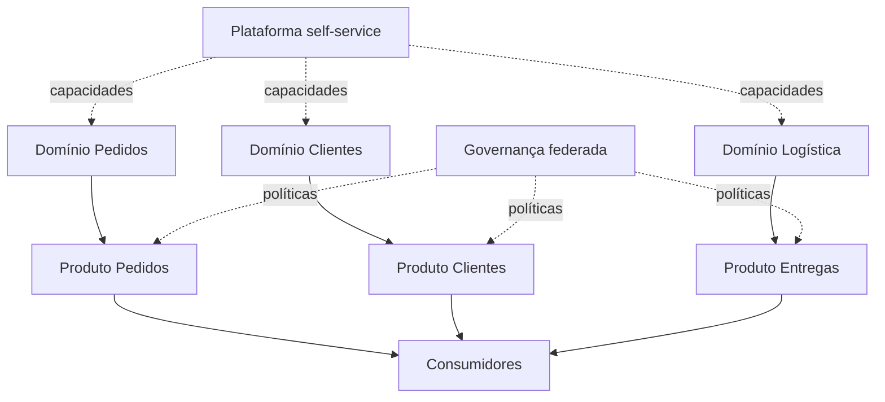

# Descentralização, Data Mesh e Data Fabric

Centralização favorece padronização e economia de escala, mas pode criar distância do domínio e filas. Descentralização aproxima responsabilidade e conhecimento do negócio, mas aumenta a necessidade de interoperabilidade e capacidades compartilhadas.

## Data Mesh

Data Mesh é uma abordagem sociotécnica fundamentada em quatro princípios:

1. propriedade de dados orientada a domínio;
2. dados como produto;
3. plataforma de dados self-service;
4. governança computacional federada.

Um produto de dados precisa ter proprietário, consumidores, contrato, documentação, SLO, política de acesso e suporte. Copiar tabelas por departamento não constitui Data Mesh.

## Data Fabric

Data Fabric enfatiza integração e automação apoiadas por metadados ativos entre ambientes heterogêneos. Catálogo, linhagem, semântica, políticas e automação conectam dados sem exigir que todos residam no mesmo sistema.

## Escolha organizacional

Mesh e Fabric não são mutuamente exclusivos nem substituem fundamentos. Mesh trata principalmente propriedade e modelo operacional; Fabric trata integração inteligente por metadados. A adoção depende da escala organizacional, maturidade de domínios, plataforma e governança.

> [!tip]
> Descentralize decisões que exigem conhecimento local e padronize capacidades que geram interoperabilidade e economia de escala.

As escolhas precisam ser registradas e testadas em [[09-Decisoes-Arquiteturais-Evolucao-e-Governanca]].
