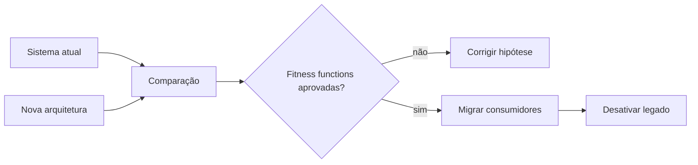

# Decisões Arquiteturais, Evolução e Governança

Uma decisão arquitetural precisa sobreviver à memória de quem a tomou. Um **Architecture Decision Record** registra contexto, decisão, status, alternativas e consequências. O ADR explica por que a escolha fazia sentido; não é ata de reunião nem documentação completa da solução.

```text
# ADR-007 — Persistir eventos brutos de pedidos
Status: aceito
Contexto: correções exigem replay auditável por sete anos.
Decisão: preservar eventos imutáveis, particionados por data de ingestão.
Consequências: maior custo de retenção; backfills reproduzíveis.
```

## Fitness functions

Fitness functions são verificações automatizadas de propriedades arquiteturais. Podem validar dependências proibidas, criptografia, compatibilidade de schema, freshness, custo máximo ou capacidade de recuperação.

```python
def validar_retencao(configuracao: dict) -> None:
    assert configuracao["raw_imutavel"] is True
    assert configuracao["retencao_dias"] >= 2555
    assert configuracao["criptografia"] is True
```

## Evolução incremental

Migrações seguras usam padrões como strangler, execução paralela, dual read, shadow traffic e troca gradual. Dual write sem coordenação transacional merece cautela porque pode criar divergência entre destinos.



Governança eficaz define guardrails, caminhos preferenciais e processo de exceção. Um conselho que apenas aprova diagramas no início não governa a evolução real.

> [!note]
> ADRs são imutáveis como registros históricos. Quando a decisão muda, crie outro ADR que substitua o anterior.

O estudo seguinte integra os fundamentos: [[10-Estudo-de-Caso-DataRetail]].
