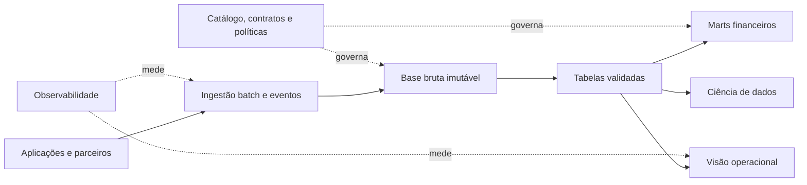

# Estudo de Caso — Arquitetura da DataRetail

A DataRetail S.A. opera lojas físicas e comércio eletrônico. Seu Warehouse suporta relatórios financeiros, mas eventos digitais, dados semiestruturados e ciência de dados cresceram. A equipe precisa ampliar a plataforma sem romper o fechamento contábil.

## Requisitos priorizados

- fechamento financeiro consistente até 08h;
- visão operacional de pedidos em até cinco minutos;
- replay auditável por sete anos;
- proteção de dados pessoais e segregação de acesso;
- SQL para analistas e dados abertos para ciência;
- migração incremental com orçamento controlado.

## Alternativas

1. ampliar apenas o Warehouse;
2. construir um Lake isolado e manter dois silos;
3. adotar uma base Lakehouse híbrida e preservar marts governados;
4. migrar toda a organização imediatamente para eventos e domínios autônomos.

A matriz ponderada favoreceu a terceira alternativa. Ela preserva eventos e arquivos brutos, aplica tabelas transacionais nas camadas validadas e mantém modelos semânticos no Warehouse durante a transição.

## Decisões e consequências

- Eventos de pedidos são fatos versionados e reprocessáveis.
- O fechamento financeiro continua batch e reconciliado.
- Dados pessoais são tokenizados antes das zonas analíticas.
- Domínios publicam contratos, mas a plataforma oferece capacidades compartilhadas.
- A migração ocorre produto por produto, com execução paralela e fitness functions.

## Critérios de sucesso

Freshness operacional p99 abaixo de cinco minutos, fechamento no prazo, reconciliação financeira sem divergências, restauração testada e custo por pedido dentro do orçamento. Se essas hipóteses falharem, o ADR será substituído, não silenciosamente reinterpretado.

> [!example]
> A arquitetura escolhida é híbrida porque os requisitos são híbridos. Uniformidade tecnológica não é um objetivo de negócio.

Consolide o conteúdo em [[11-Resumo]].
