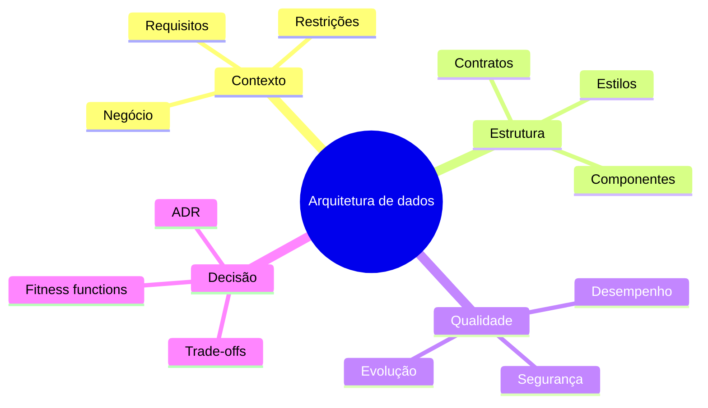

# Resumo

- Arquitetura reúne decisões estruturais significativas e suas consequências.
- Diagramas representam visões; não substituem contratos, princípios e operação.
- Requisitos úteis possuem cenário e medida verificável.
- Atributos de qualidade competem e exigem trade-offs explícitos.
- Estilos restringem a organização para favorecer propriedades específicas.
- Eventos registram fatos; comandos solicitam ações.
- Batch, streaming e abordagens híbridas atendem necessidades temporais diferentes.
- Warehouse, Lake e Lakehouse podem coexistir em uma plataforma.
- Data Mesh trata propriedade e modelo operacional; Data Fabric enfatiza integração por metadados.
- ADRs preservam contexto e consequências das decisões.
- Fitness functions verificam propriedades continuamente.
- Arquiteturas evoluem melhor por migração incremental e evidências.

Teste sua compreensão em [[12-Perguntas-de-Entrevista]] e [[13-Exercicios]].
