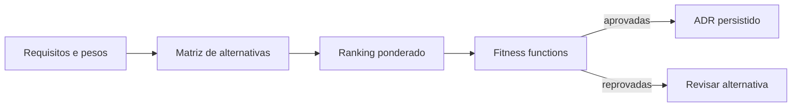

# Laboratório — Decisão Arquitetural Executável

## Objetivo

Comparar alternativas para a DataRetail S.A., validar propriedades obrigatórias da vencedora e persistir uma decisão arquitetural idempotente.

## Pré-requisitos

- Python 3.10 ou superior;
- biblioteca padrão do Python;
- noções de atributos de qualidade e ADRs.

## Ambiente

Salve a solução como `decisao_arquitetural.py`. O programa usa um arquivo SQLite temporário, removido ao final.

## Passo a passo

1. Defina critérios e pesos cuja soma seja `1.0`.
2. Atribua notas de `1` a `5` para cada alternativa.
3. Calcule a pontuação ponderada.
4. Selecione a maior pontuação com desempate determinístico.
5. Execute fitness functions sobre a configuração vencedora.
6. Persista o ADR com chave estável e upsert.
7. Repita a persistência e confirme que existe um único registro.

## Alternativas

- `warehouse_centralizado`;
- `lakehouse_hibrido`;
- `orientada_a_eventos`.



## Resultado esperado

```text
warehouse_centralizado=3.05
lakehouse_hibrido=4.05
orientada_a_eventos=3.70
alternativa=lakehouse_hibrido
fitness_functions=aprovadas
adrs_persistidos=1
segunda_execucao=sem_duplicacao
arquitetura=ok
```

## Validação e conclusão

O ranking apoia a decisão, mas não a automatiza de forma neutra: pesos e notas representam julgamento explícito. As fitness functions impedem que uma alternativa bem pontuada viole restrições obrigatórias.

Compare com [[14-Solucao]].
