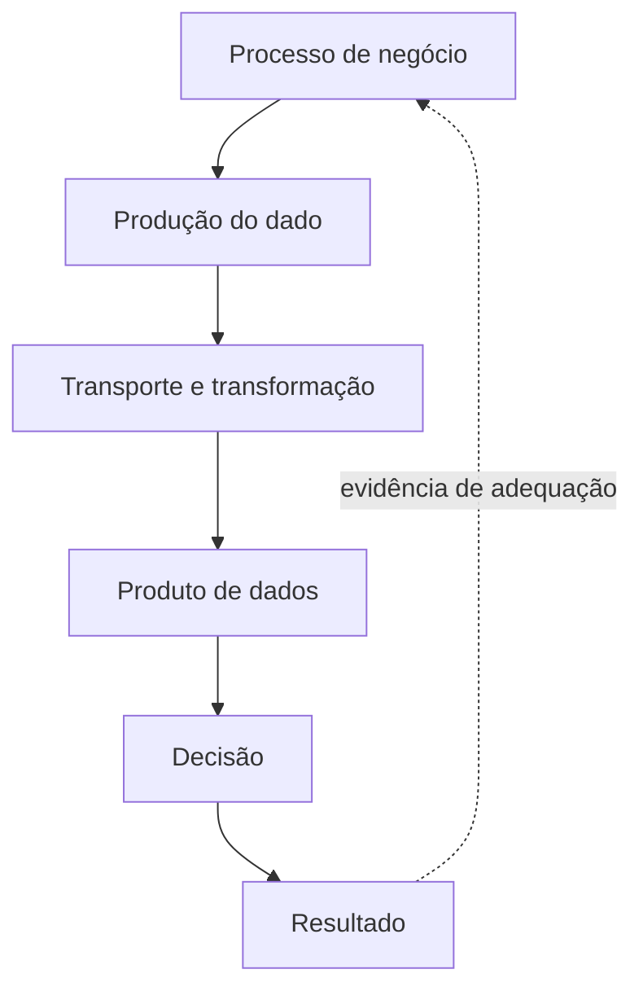

# Introdução

Um valor pode ser tecnicamente válido e ainda inadequado para uma decisão. Um endereço sem número talvez seja suficiente para segmentação regional, mas não para entrega. Qualidade depende do uso, do risco e do momento em que o dado é consumido.

Problemas aparecem em toda a cadeia: captura incorreta, contrato ambíguo, integração incompleta, transformação defeituosa, atraso, duplicação ou interpretação errada. Corrigir apenas a tabela final oculta a origem e permite recorrência.

## Qualidade por design

A abordagem madura combina prevenção na origem, detecção rápida, contenção, correção e aprendizado. Nem toda violação deve interromper o pipeline: algumas exigem quarentena do registro, outras bloqueiam a partição e outras apenas geram tendência para investigação.

> [!warning]
> Um dashboard verde de execução não prova que os dados representam corretamente o negócio.

O próximo capítulo estabelece a definição de [[03-O-que-e-Qualidade-de-Dados]].
