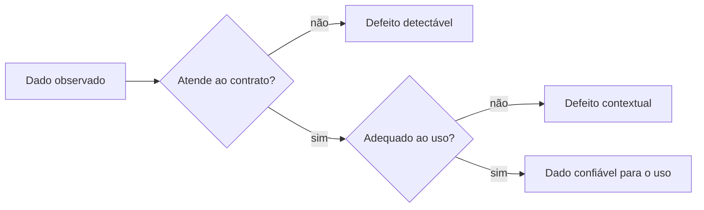

# O que é Qualidade de Dados

Qualidade de dados é o grau em que dados atendem aos requisitos do uso pretendido. Essa definição combina propriedades intrínsecas, como formato válido, e contextuais, como atualidade suficiente para uma decisão.

## Conceitos relacionados

| Conceito | Significado |
|---|---|
| Expectativa | comportamento desejado para dados ou serviço |
| Regra | condição verificável derivada da expectativa |
| Métrica | medida agregada de uma dimensão |
| Teste | avaliação que produz evidência e resultado |
| Defeito | divergência entre dado observado e requisito |
| Incidente | defeito com impacto que exige resposta coordenada |

## Dado errado ou representação errada

Um erro sintático viola formato ou tipo. Um erro semântico usa um valor permitido com significado incorreto. Um erro de relacionamento associa entidades incompatíveis. Um erro temporal apresenta um estado verdadeiro, porém desatualizado.

## Custo da não qualidade

Inclui retrabalho, decisões incorretas, fraude não detectada, perda de receita, multas, atrasos e erosão de confiança. O custo do controle também existe; por isso, a intensidade da validação deve acompanhar criticidade e risco.

> [!note]
> Qualidade não é valor absoluto. O mesmo conjunto pode ser adequado para exploração e inadequado para fechamento financeiro.

Para tornar a definição operacional, use [[04-Dimensoes-Metricas-e-Perfis]].
