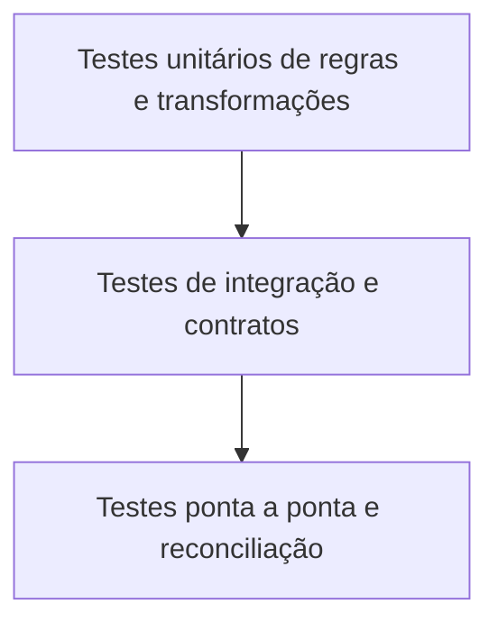

# Testes de Dados e Pirâmide de Qualidade

Testes de dados produzem evidências em diferentes fronteiras. Quanto mais cedo e isoladamente um defeito for detectado, menor tende a ser o custo de diagnóstico.

## Camadas

- **Unitários:** funções, regras e transformações com entradas pequenas e conhecidas.
- **Schema e contrato:** estrutura, tipos, compatibilidade e metadados.
- **Integração:** interação com fonte, destino e formatos reais.
- **Dados em produção:** invariantes, distribuições, freshness e volume.
- **Ponta a ponta:** reconciliação com controles independentes e resultado do negócio.

## Categorias de regra

Testes de coluna verificam nulos, domínio e faixa. Testes entre colunas verificam relações como `data_entrega >= data_pedido`. Testes entre tabelas validam integridade e reconciliação. Testes temporais verificam atraso e continuidade de partições.

## Dados de teste

Casos devem cobrir caminho feliz, limites, nulos, duplicações, atraso, schemas incompatíveis e falhas. Dados sintéticos reduzem exposição, mas precisam representar características relevantes. Amostras de produção devem ser protegidas e minimizadas.

> [!tip]
> Teste a lógica e também a configuração: uma regra correta aplicada à coluna errada continua produzindo confiança falsa.

Execução contínua e resposta são abordadas em [[07-Monitoramento-Incidentes-e-SLOs-de-Qualidade]].
