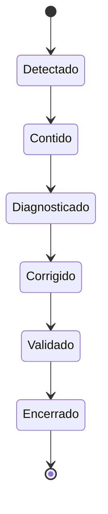

# Monitoramento, Incidentes e SLOs de Qualidade

Monitoramento compara sinais com expectativas conhecidas. Observabilidade ajuda a investigar situações não previstas. Para qualidade, ambos precisam conectar métrica técnica ao impacto sobre produtos e consumidores.

## SLI e SLO

Um SLI mede comportamento, como percentual de registros válidos. Um SLO define a meta e a janela. Threshold é um limite de decisão em uma execução; SLO avalia confiabilidade ao longo do tempo.

```text
SLI_validade = pedidos aprovados / pedidos avaliados
SLO_validade = SLI_validade >= 99,9% em 30 dias
```

## Quality gates

Um gate decide se dados podem avançar. A política deve combinar severidade, escopo e tolerância. Chave ausente em uma tabela financeira pode bloquear tudo; um telefone inválido pode colocar apenas o registro em quarentena.



## Incidentes

O processo inclui detecção, triagem, contenção, comunicação, correção, backfill, validação e análise sem culpabilização. Registre impacto, intervalo afetado, linhagem, causa contribuinte e ações preventivas.

Alertas devem ser acionáveis e deduplicados. O proprietário precisa saber qual regra falhou, em qual partição, com qual impacto e qual runbook seguir.

> [!warning]
> Alertar para toda oscilação cria fadiga. Silenciar sem revisar o contrato apenas oculta o risco.

A operação depende de papéis claros em [[08-Responsabilidades-Processos-e-Governanca]].
