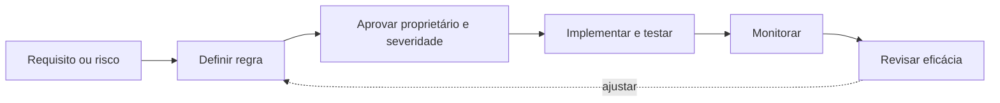

# Responsabilidades, Processos e Governança

Qualidade é responsabilidade compartilhada, mas não anônima. O produtor controla captura e semântica de origem; a equipe de plataforma oferece capacidades; o proprietário do produto define compromissos; consumidores comunicam uso e impacto.

| Papel | Responsabilidade principal |
|---|---|
| Data Owner | decisão, risco e prioridade no domínio |
| Data Steward | definição, regras e coordenação cotidiana |
| Produtor | correção na origem e evolução do contrato |
| Engenharia | implementação, testes e operação técnica |
| Plataforma | ferramentas, padrões e self-service |
| Consumidor | requisitos de uso e feedback de impacto |

## Processo de regras

Uma regra nasce de risco ou requisito, recebe proprietário, severidade e ação, é implementada e observada. Regras obsoletas devem ser versionadas e desativadas com evidência, não acumuladas indefinidamente.

## Catálogo e linhagem

O catálogo torna definições, contratos e responsáveis encontráveis. A linhagem mostra origem e consumidores afetados. Nenhum deles garante qualidade sozinho, mas ambos reduzem tempo de diagnóstico e coordenação.

> [!note]
> Um RACI genérico não substitui ownership operacional. Cada produto crítico precisa de contato, horário de suporte e critérios de escalonamento.

Os papéis sustentam a prática de [[09-Prevencao-Correcao-e-Melhoria-Continua]].
