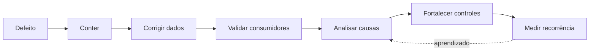

# Prevenção, Correção e Melhoria Contínua

Prevenção atua antes do defeito: validação na interface, tipos adequados, listas de domínio, chaves, contratos e treinamento do processo. Detecção identifica desvios. Contenção limita propagação. Correção restaura dados e consumidores. Melhoria remove causas sistêmicas.

## Corrigir na origem

Sempre que possível, corrija o processo produtor e depois reprocese dados históricos. Ajustes apenas no destino criam semânticas divergentes e regras duplicadas. Quando a origem não pode mudar imediatamente, registre a compensação, seu proprietário e prazo.

## Quarentena e imputação

Quarentena preserva registro, causa, versão da regra e contexto para posterior tratamento. Imputação substitui valores ausentes com uma estimativa e precisa ser identificável; não deve fabricar acurácia aparente em decisões críticas.

## Análise de causa

Perguntar “por quê?” repetidamente ajuda, mas causas raramente são únicas. Analise processo, interface, incentivo, controle, mudança e detecção. Ações fortes alteram o sistema; pedir “mais atenção” é uma ação fraca.

> [!tip]
> Priorize pelo produto entre impacto, frequência e detectabilidade, não apenas pela quantidade de registros afetados.

Veja a aplicação integrada em [[10-Estudo-de-Caso-DataRetail]].
