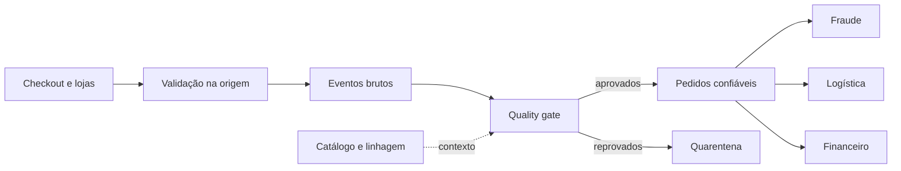

# Estudo de Caso — Qualidade de Pedidos da DataRetail

A DataRetail S.A. percebeu divergências entre pedidos, faturamento e logística. A equipe corrigia relatórios manualmente, mas os defeitos reapareciam porque regras e responsabilidades não estavam formalizadas.

## Usos críticos

- liberação de pagamento e fraude;
- separação e entrega;
- fechamento financeiro;
- análise comercial.

Cada uso recebeu requisitos diferentes. A visão antifraude prioriza freshness; o fechamento exige reconciliação e completude; a entrega exige acurácia de endereço.

## Contrato inicial

- `pedido_id` e `event_id` obrigatórios e únicos em seus grãos;
- `cliente_id` deve existir no cadastro vigente;
- valor não pode ser negativo;
- status pertence ao domínio versionado;
- eventos operacionais disponíveis em até cinco minutos;
- partição financeira só é publicada após reconciliação.

## Incidente

Uma mudança no aplicativo enviou valor em centavos sem alterar nome ou tipo do campo. O schema permaneceu válido, mas a distribuição e a reconciliação dispararam alertas. A equipe conteve a nova versão, corrigiu o produtor, reprocessou o intervalo e adicionou regra semântica de unidade ao contrato.

## Modelo operacional

O domínio de Pedidos possui o contrato; Engenharia implementa testes; a plataforma fornece execução e catálogo; Financeiro define tolerâncias de reconciliação. Regras críticas bloqueiam partição, enquanto violações isoláveis seguem para quarentena.

> [!example]
> O incidente demonstra por que schema válido, sozinho, não garante significado correto.

Consolide os aprendizados em [[11-Resumo]].
