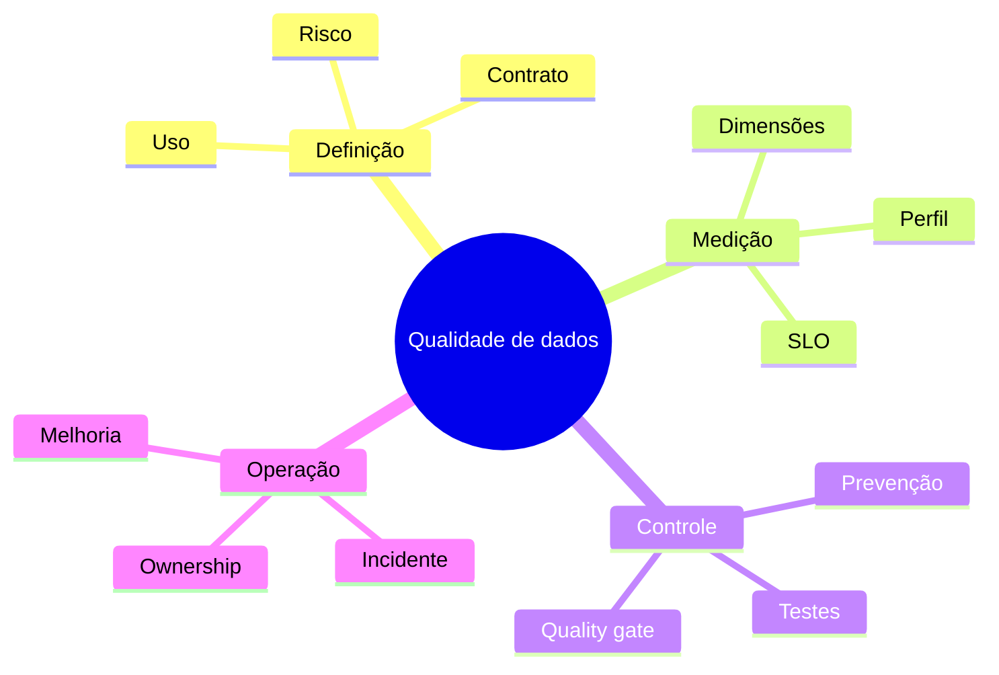

# Resumo

- Qualidade é adequação ao uso, não perfeição abstrata.
- Regras protegem decisões, processos e obrigações identificáveis.
- Dimensões organizam métricas, mas precisam de definição operacional.
- Profiling descobre padrões e hipóteses; não define intenção sozinho.
- Contratos reúnem schema, semântica, operação e governança.
- Testes devem existir da unidade à reconciliação ponta a ponta.
- Threshold decide uma execução; SLO mede confiabilidade numa janela.
- Quality gates podem bloquear, alertar ou isolar registros.
- Incidentes exigem contenção, correção, comunicação e aprendizado.
- Responsabilidade é compartilhada, com ownership explícito.
- Correção na origem reduz recorrência e divergência semântica.
- Quarentena preserva evidência; imputação precisa ser transparente.

Teste sua compreensão em [[12-Perguntas-de-Entrevista]] e [[13-Exercicios]].
