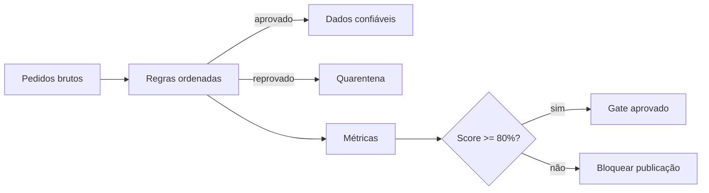

# Laboratório — Quality Gate de Pedidos

## Objetivo

Implementar um quality gate para pedidos da DataRetail S.A., calculando quatro dimensões, isolando registros inválidos e registrando evidências de maneira idempotente.

## Pré-requisitos

- Python 3.10 ou superior;
- somente biblioteca padrão;
- conhecimentos básicos de Python e SQLite.

## Ambiente

Salve a solução como `quality_gate.py`. O banco temporário é criado e removido pelo programa.

## Passo a passo

1. Crie seis registros de pedido e dois clientes válidos.
2. Verifique completude da chave, validade do valor, integridade do cliente e unicidade do evento.
3. Atribua uma causa primária a cada registro reprovado.
4. Calcule a taxa de aprovação de cada dimensão.
5. Calcule o score médio e aplique threshold de 80%.
6. Persista execução, métricas e quarentena.
7. Repita a mesma run e confirme ausência de duplicação.



## Resultado esperado

```text
registros=6
aprovados=2
quarentena=4
completude=83.33
validade=83.33
integridade=83.33
unicidade=83.33
score=83.33
quality_gate=aprovado
violacoes_persistidas=4
segunda_execucao=sem_duplicacao
qualidade=ok
```

## Conclusão

O gate torna regras, métricas e decisão reproduzíveis. Em produção, pesos, severidades e thresholds devem derivar do contrato e do risco, não deste exemplo didático.

Compare sua implementação com [[14-Solucao]].
