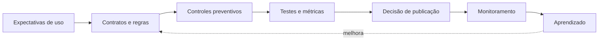

# Módulo 09 — Qualidade de Dados

> [!abstract]
> Qualidade de dados é adequação ao uso. Ela nasce de expectativas explícitas, controles preventivos, medições, responsabilidade e resposta operacional — não de uma limpeza isolada no final do pipeline.

## Estrutura

- [[01-Objetivos]]
- [[02-Introducao]]
- [[03-O-que-e-Qualidade-de-Dados]]
- [[04-Dimensoes-Metricas-e-Perfis]]
- [[05-Contratos-Schemas-e-Regras-de-Negocio]]
- [[06-Testes-de-Dados-e-Piramide-de-Qualidade]]
- [[07-Monitoramento-Incidentes-e-SLOs-de-Qualidade]]
- [[08-Responsabilidades-Processos-e-Governanca]]
- [[09-Prevencao-Correcao-e-Melhoria-Continua]]
- [[10-Estudo-de-Caso-DataRetail]]
- [[11-Resumo]]
- [[12-Perguntas-de-Entrevista]]
- [[13-Exercicios]]
- [[13-Gabarito]]
- [[14-Laboratorio]]
- [[14-Solucao]]
- [[15-Referencias]]

## Projeto integrador

A DataRetail S.A. implementará um quality gate para pedidos, com perfil, regras, quarentena, métricas e execução idempotente.
