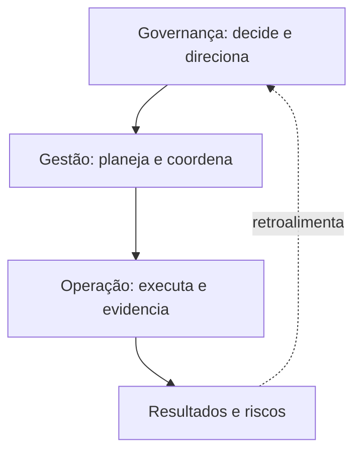

# Introdução

À medida que dados atravessam áreas e sistemas, surgem decisões que nenhuma equipe técnica pode tomar sozinha: quem define “cliente ativo”, quem autoriza uso secundário, quanto tempo preservar um evento e quem responde quando um produto deixa de cumprir seu contrato?

Governança cria o sistema pelo qual essas decisões são tomadas, aplicadas e revistas. Gestão de dados executa capacidades como qualidade, metadados e segurança. Operação realiza atividades cotidianas. As três dimensões se complementam.

Uma iniciativa que produz comitês e documentos, mas não altera acesso, qualidade ou responsabilidade, governa apenas no papel. Por outro lado, automação sem legitimidade de decisão pode aplicar regras tecnicamente consistentes e organizacionalmente erradas.

> [!warning]
> Governança não é sinônimo de bloqueio. Bons guardrails tornam o caminho seguro mais rápido que a exceção improvisada.

O próximo capítulo define [[03-O-que-e-Governanca-de-Dados]].
