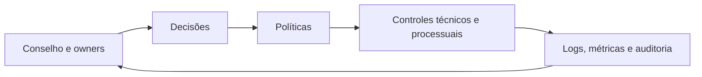

# O que é Governança de Dados

Governança de dados é o sistema de autoridade, responsabilidade e controle que orienta decisões sobre dados ao longo de seu ciclo de vida. Seu propósito é equilibrar geração de valor, redução de risco e cumprimento de obrigações.

## Perguntas de governança

- Quem pode criar, alterar, acessar, compartilhar e excluir?
- Quem define significado e critérios de qualidade?
- Qual política se aplica e como a exceção é aprovada?
- Qual evidência comprova cumprimento?
- Como conflitos entre domínios são resolvidos?

## Governança, gestão e tecnologia

| Disciplina | Foco |
|---|---|
| Governança | direitos de decisão, accountability e direção |
| Gestão | planejamento e coordenação das capacidades |
| Arquitetura | estruturas e decisões técnicas significativas |
| Segurança | proteção contra acesso e alteração indevidos |
| Qualidade | adequação dos dados ao uso |

Governança cobre dados estruturados e não estruturados, metadados, modelos, produtos e decisões automatizadas conforme o escopo organizacional. Nem todo dado exige o mesmo rigor: criticidade e risco orientam proporcionalidade.

> [!note]
> Accountability permanece com quem possui autoridade e obrigação de responder, mesmo quando atividades são delegadas.

O desenho começa por [[04-Principios-Escopo-e-Modelo-Operacional]].
