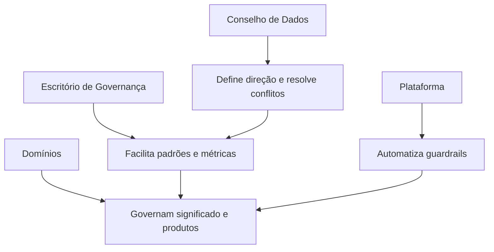

# Princípios, Escopo e Modelo Operacional

Princípios orientam escolhas recorrentes. Exemplos: dados possuem owner; acesso segue menor privilégio; classificações acompanham cópias; decisões críticas deixam evidência; controles são proporcionais ao risco.

## Definição do escopo

Comece por resultados e riscos concretos, não pela catalogação de tudo. Se o problema é divergência financeira, priorize conceitos, produtos e controles do fluxo financeiro. Expanda após demonstrar valor.

O escopo pode ser definido por domínio, processo, produto, classificação, obrigação regulatória ou criticidade. Um inventário mínimo deve saber o que existe, quem responde, onde está e para que é usado.

## Modelo operacional

Fóruns precisam de mandato, participantes, cadência, entrada, saída e critérios de escalonamento. Reuniões sem autoridade acumulam pendências; autoridade sem evidência produz decisões arbitrárias.

## Priorização

Use criticidade, sensibilidade, alcance, impacto e probabilidade. Dados mestres, financeiros, pessoais e produtos com muitos consumidores tendem a receber controles mais fortes.

> [!tip]
> Comece pequeno o suficiente para entregar resultado e estruturado o suficiente para ser repetido.

O modelo se materializa em [[05-Papeis-Responsabilidades-e-Dominios]].
