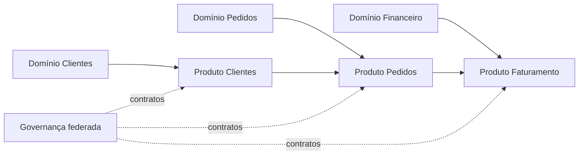

# Papéis, Responsabilidades e Domínios

Papéis devem conectar autoridade, trabalho e prestação de contas. Títulos variam entre organizações; a responsabilidade precisa permanecer inequívoca.

| Papel | Responsabilidade |
|---|---|
| Data Owner | decide risco, prioridade, acesso e uso no domínio |
| Data Steward | mantém definições, regras e questões cotidianas |
| Custodian | opera a proteção e a plataforma técnica |
| Product Owner | responde pelo valor e contrato do produto de dados |
| Conselho | define direção e resolve conflitos transversais |
| Consumidor | cumpre termos de uso e comunica novos requisitos |

## Domínios

Domínios agrupam capacidades e linguagem de negócio, não organogramas temporários. Fronteiras podem ser identificadas por eventos, regras, ciclo de vida e autoridade. Conceitos compartilhados exigem acordo de interoperabilidade, não necessariamente um único banco.

## RACI e accountability

RACI ajuda a mapear quem executa, responde, é consultado e informado. Evite múltiplos *Accountable* para a mesma decisão. Uma matriz não substitui capacidade, tempo e incentivos para exercer o papel.

> [!warning]
> Nomear stewards sem autoridade, acesso ou carga horária cria responsabilidade simbólica.

Os papéis aplicam [[06-Politicas-Padroes-e-Controles]].
