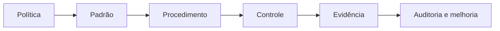

# Políticas, Padrões e Controles

Política expressa intenção e obrigação. Padrão define requisitos obrigatórios. Procedimento descreve como executar. Controle reduz risco ou demonstra cumprimento. Evidência registra que o controle ocorreu.



## Tipos de controle

- **Preventivo:** impede configuração ou acesso inadequado.
- **Detectivo:** identifica desvio após ou durante a ocorrência.
- **Corretivo:** restaura conformidade e reduz recorrência.
- **Compensatório:** reduz risco quando o controle preferencial não é viável.

Controles podem ser manuais, automatizados ou híbridos. Automação aumenta consistência, mas depende de regras corretas, cobertura e manutenção. Todo controle precisa de objetivo, owner, frequência, população, evidência e tratamento de falha.

## Policy as code

Políticas executáveis traduzem requisitos para validações versionadas. Por exemplo, ativos classificados como restritos podem exigir criptografia, política de acesso, owner e retenção mínima. Exceções devem expirar e manter justificativa e aprovador.

```python
def validar_ativo(ativo: dict) -> None:
    assert ativo["owner"]
    if ativo["classificacao"] == "restrito":
        assert ativo["politica_acesso"] is True
```

> [!tip]
> Controle sem evidência é difícil de auditar; evidência sem vínculo com risco vira coleta burocrática.

As políticas dependem de contexto fornecido por [[07-Metadados-Catalogo-Linhagem-e-Glossario]].
