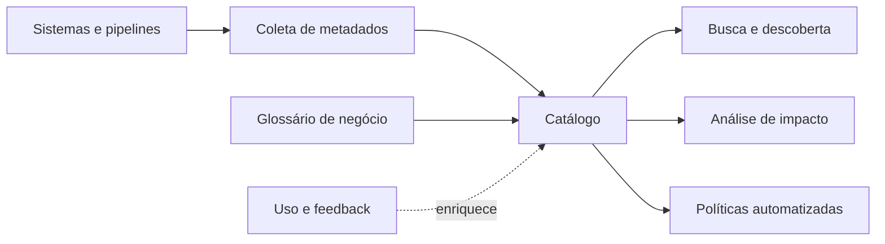

# Metadados, Catálogo, Linhagem e Glossário

Metadados descrevem dados. Metadados técnicos incluem schema, formato e localização; operacionais registram execução e uso; de negócio explicam significado e owner; sociais capturam colaboração e avaliação.

## Componentes

| Componente | Responde |
|---|---|
| Inventário | quais ativos existem? |
| Catálogo | como encontrá-los e avaliá-los? |
| Glossário | o que os conceitos significam? |
| Linhagem | de onde vieram e quem depende deles? |
| Classificação | qual sensibilidade e política se aplica? |

## Linhagem

Linhagem pode existir no nível de sistema, dataset, coluna ou transformação. Maior granularidade custa mais. Ela apoia análise de impacto, investigação de incidentes, auditoria e confiança, mas precisa refletir execuções reais.

## Metadados ativos

Metadados ativos acionam comportamento: classificação propaga política, mudança de schema alerta consumidores, popularidade influencia suporte e SLO violado abre incidente. Isso aproxima governança do fluxo de trabalho.

> [!warning]
> Catalogar sem processo de atualização cria um inventário rapidamente obsoleto. Automatize coleta e atribua stewardship ao contexto que não pode ser inferido.

O contexto alimenta controles de [[08-Seguranca-Privacidade-Retencao-e-Conformidade]].
