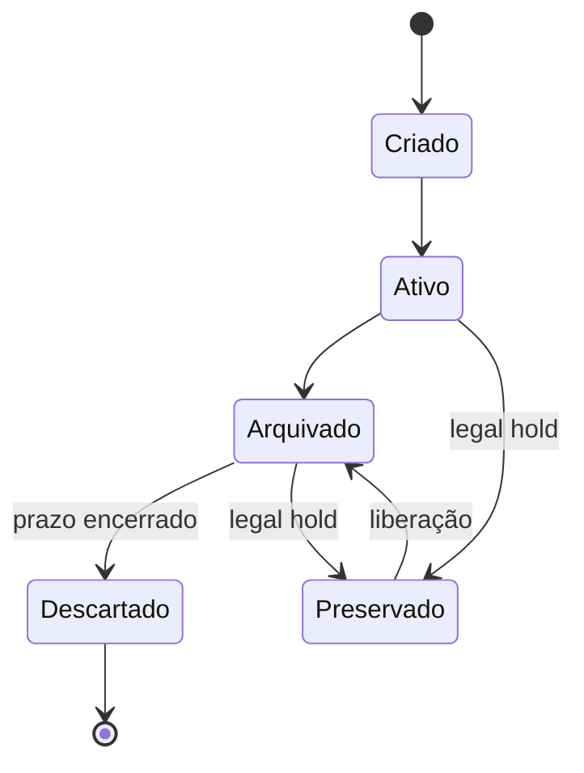

# Segurança, Privacidade, Retenção e Conformidade

Classificação conecta natureza e risco do dado a controles. Um modelo simples pode usar público, interno, confidencial e restrito. Critérios e exemplos precisam ser claros; rótulos sem consequências não protegem nada.

## Acesso

Menor privilégio limita permissões ao necessário. RBAC associa acesso a papéis; ABAC avalia atributos como domínio, finalidade e classificação. Segregação de funções reduz conflitos. Revisões periódicas removem acessos acumulados.

## Privacidade

Princípios incluem finalidade, necessidade, transparência, exatidão, segurança, prevenção e responsabilização. Minimize coleta e cópias. Pseudonimização reduz exposição, mas não torna automaticamente o dado anônimo.

## Retenção e descarte

Retenção deve derivar de obrigação, uso e risco. O prazo começa em um evento definido e cobre cópias, backups e derivados conforme a política. Legal hold suspende descarte quando há obrigação de preservação.

Conformidade não é apenas produzir relatório para auditoria. É manter controles operantes e evidências íntegras ao longo do tempo.

> [!note]
> Requisitos legais variam por jurisdição e contexto. A implementação deve envolver profissionais jurídicos e de privacidade qualificados.

Resultados e escala são tratados em [[09-Maturidade-Metricas-e-Governanca-Federada]].
