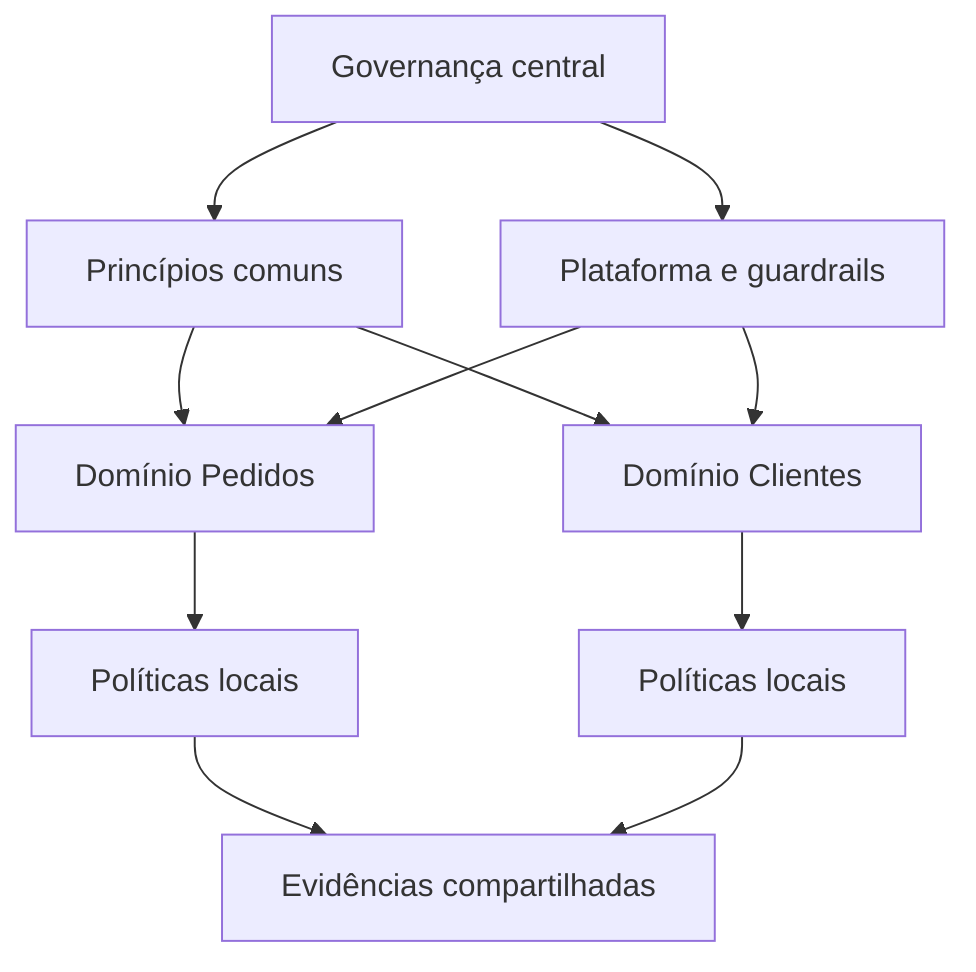

# Maturidade, Métricas e Governança Federada

Maturidade descreve capacidade consistente, não quantidade de documentos. Uma organização pode ter catálogo completo e continuar sem owners capazes de decidir. Avalie pessoas, processo, tecnologia, dados e resultados.

## Métricas

- percentual de ativos críticos com owner e classificação;
- tempo para conceder acesso conforme política;
- cobertura de linhagem dos produtos críticos;
- exceções vencidas e tempo de remediação;
- cumprimento de SLOs e redução de incidentes;
- uso e valor dos produtos governados.

Métricas de atividade, como reuniões realizadas, ajudam a gerir trabalho, mas não demonstram resultado sozinhas.

## Governança federada

Federação distribui decisões próximas aos domínios e preserva regras comuns de interoperabilidade, segurança e responsabilidade. O centro define princípios, capacidades e guardrails; domínios implementam e decidem dentro desses limites.

## Evolução

Comece pelos ativos de maior valor e risco, estabeleça baseline, implemente controles, meça resultado e amplie. Modelos de maturidade ajudam a conversar, mas não devem impor uma corrida uniforme por níveis.

> [!tip]
> Padronize o mínimo necessário para interoperar e proteger; preserve decisões locais onde o contexto do domínio é determinante.

Veja a integração dos conceitos em [[10-Estudo-de-Caso-DataRetail]].
