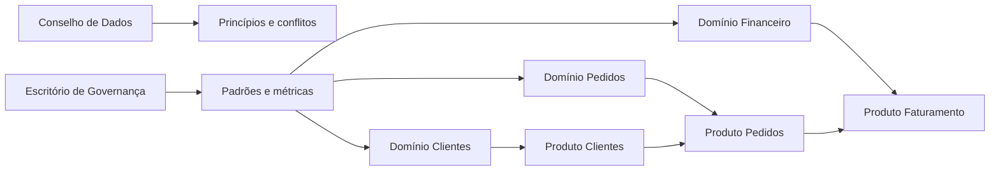

# Estudo de Caso — Governança da DataRetail

A DataRetail S.A. cresceu por aquisições. Definições de receita divergiam, acessos permaneciam ativos após mudanças de função e ninguém respondia por datasets compartilhados. A empresa decidiu começar pelos produtos de Pedidos, Clientes e Faturamento.

## Objetivos

- unificar conceitos usados no fechamento;
- atribuir owners e stewards;
- classificar dados pessoais e financeiros;
- aplicar acesso por finalidade e menor privilégio;
- definir retenção e descarte;
- reduzir tempo de análise de impacto.

## Modelo operacional

Cada produto recebe contrato, owner, classificação, SLO, linhagem e política de acesso. A plataforma bloqueia implantação de ativo restrito sem owner, criptografia e prazo de retenção. Exceções expiram em 30 dias e exigem aprovador.

## Conflito semântico

Comercial definia receita na confirmação do pedido; Financeiro, no faturamento. O conselho não escolheu um termo vencedor: formalizou `valor_pedido_confirmado` e `receita_faturada`, com owners, eventos de reconhecimento e usos permitidos.

## Indicadores

A DataRetail acompanha cobertura de ownership, classificação e linhagem, tempo de acesso, exceções vencidas, incidentes e cumprimento de SLOs. A expansão para outros domínios depende da redução comprovada de risco e retrabalho.

> [!example]
> Governar não eliminou diferenças legítimas; tornou significado e uso explícitos para impedir equivalências falsas.

Consolide os aprendizados em [[11-Resumo]].
