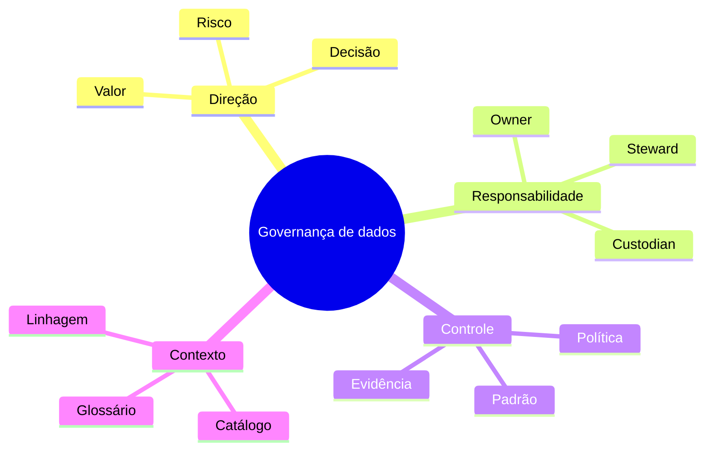

# Resumo

- Governança define autoridade, responsabilidade e controle sobre decisões de dados.
- Gestão coordena capacidades; operação executa e produz evidência.
- Escopo deve partir de valor, risco e criticidade.
- Owners respondem por decisões; stewards mantêm contexto e regras.
- Políticas orientam; padrões especificam; controles reduzem risco.
- Policy as code aproxima requisitos do fluxo de trabalho.
- Catálogo, glossário e linhagem oferecem contexto e impacto.
- Classificação aciona controles de acesso, privacidade e retenção.
- Exceções precisam de justificativa, aprovador e expiração.
- Maturidade é capacidade repetível e resultado, não volume de artefatos.
- Federação combina decisões locais com guardrails comuns.
- Governança eficaz torna o caminho correto mais simples e verificável.

Teste sua compreensão em [[12-Perguntas-de-Entrevista]] e [[13-Exercicios]].
