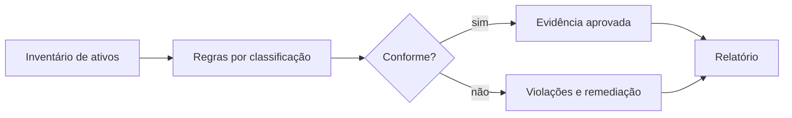

# Laboratório — Política Executável de Governança

## Objetivo

Implementar uma avaliação de conformidade para ativos da DataRetail S.A., persistindo violações e evidências de maneira idempotente.

## Pré-requisitos

- Python 3.10 ou superior;
- biblioteca padrão do Python;
- noções de classificação, ownership e retenção.

## Ambiente

Salve a solução como `governanca.py`. O programa cria um banco SQLite temporário e o remove ao final.

## Passo a passo

1. Cadastre quatro ativos com owner, classificação, retenção e política de acesso.
2. Exija owner para todos os ativos.
3. Exija política de acesso para classificações confidencial e restrita.
4. Exija retenção mínima de sete anos para confidencial e um ano para restrito.
5. Calcule ativos conformes e violações.
6. Persista avaliação e violações com chaves estáveis.
7. Execute a persistência duas vezes e valide ausência de duplicação.



## Resultado esperado

```text
ativos=4
conformes=2
nao_conformes=2
violacoes=4
cobertura_owner=50.00
decisao=reprovado
violacoes_persistidas=4
segunda_execucao=sem_duplicacao
governanca=ok
```

## Conclusão

O laboratório converte requisitos em controles repetíveis e evidências auditáveis. Em produção, regras devem ser versionadas, exceções precisam expirar e owners devem receber fluxos de remediação.

Compare com [[14-Solucao]].
