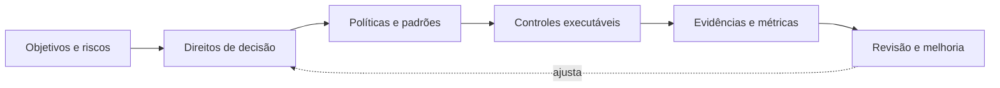

# Módulo 10 — Governança de Dados

> [!abstract]
> Governança de dados define direitos de decisão, responsabilidades e controles para que dados gerem valor dentro de limites de risco. Políticas só governam quando se tornam práticas verificáveis no ciclo de vida.

## Estrutura

- [[01-Objetivos]]
- [[02-Introducao]]
- [[03-O-que-e-Governanca-de-Dados]]
- [[04-Principios-Escopo-e-Modelo-Operacional]]
- [[05-Papeis-Responsabilidades-e-Dominios]]
- [[06-Politicas-Padroes-e-Controles]]
- [[07-Metadados-Catalogo-Linhagem-e-Glossario]]
- [[08-Seguranca-Privacidade-Retencao-e-Conformidade]]
- [[09-Maturidade-Metricas-e-Governanca-Federada]]
- [[10-Estudo-de-Caso-DataRetail]]
- [[11-Resumo]]
- [[12-Perguntas-de-Entrevista]]
- [[13-Exercicios]]
- [[13-Gabarito]]
- [[14-Laboratorio]]
- [[14-Solucao]]
- [[15-Referencias]]

## Projeto integrador

A DataRetail S.A. criará um controle executável para ownership, classificação, retenção e acesso de seus ativos de dados.
