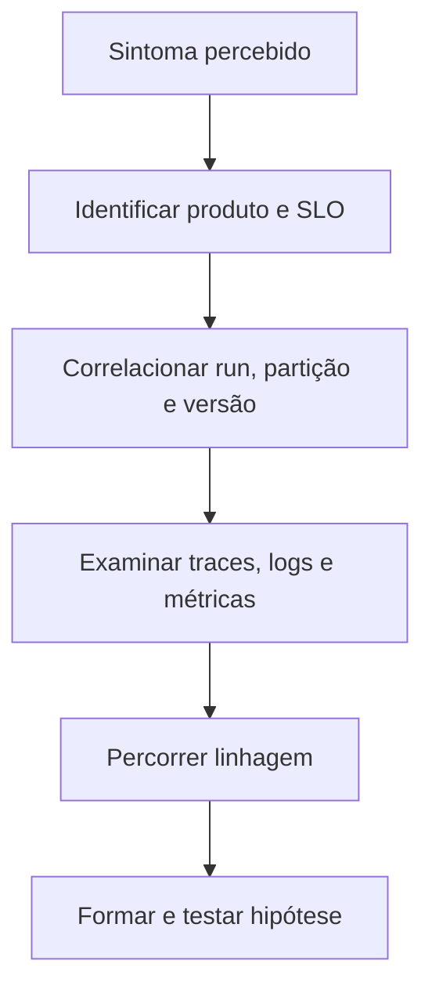

# Introdução

Monitoramento verifica condições conhecidas: o job terminou, a fila cresceu, a partição chegou. Observabilidade permite investigar perguntas que não foram antecipadas: por que somente clientes de uma região receberam dados atrasados após uma mudança de schema?

Em sistemas de dados, o processo pode estar tecnicamente disponível e ainda publicar conteúdo incompleto. Por isso, sinais de infraestrutura e execução precisam ser combinados com volume, distribuição, schema, freshness, qualidade, linhagem e uso.

Uma plataforma observável preserva contexto: `trace_id`, `run_id`, dataset, partição, versão e ambiente. Sem correlação, a equipe alterna entre ferramentas e reconstrói manualmente a história do incidente.

> [!warning]
> Coletar tudo não garante observabilidade. Sinais sem contexto, qualidade ou política de retenção apenas elevam custo e ruído.

O próximo capítulo define [[03-O-que-e-Observabilidade-de-Dados]].
