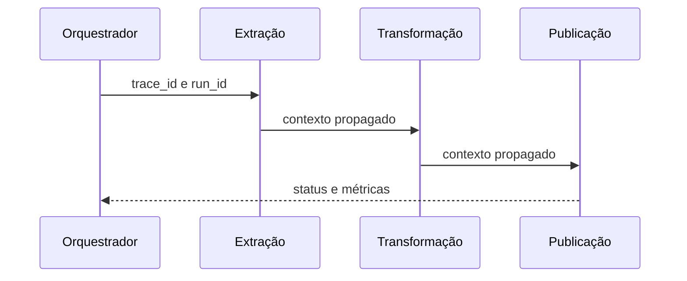

# Logs, Métricas, Traces e Correlação

Logs registram eventos; métricas agregam medidas ao longo do tempo; traces representam o caminho causal de uma operação distribuída. Perfis mostram consumo de recursos por código. Cada sinal responde melhor a perguntas diferentes.

## Logs estruturados

Inclua timestamp, severidade, serviço, ambiente, evento, `trace_id`, `run_id`, dataset e partição. Mensagens devem registrar fatos e campos consultáveis, sem segredos ou dados pessoais desnecessários.

```json
{"level":"ERROR","task":"publish","run_id":"run-011","dataset":"pedidos","partition":"2026-07-16","error_code":"TIMEOUT"}
```

## Métricas e cardinalidade

Contadores, gauges e histogramas sustentam taxas, estados e distribuições. Labels como `customer_id` podem criar cardinalidade ilimitada e custo elevado. Dimensões detalhadas pertencem a logs ou traces quando não são seguras como labels.

## Traces

Um trace contém spans com início, duração, status, atributos e relações. Em pipelines assíncronos, propagar contexto entre filas, jobs e motores exige instrumentação deliberada.



> [!tip]
> Padronize nomes e atributos entre equipes; correlação falha quando o mesmo conceito possui chaves incompatíveis.

Telemetria técnica deve se conectar a [[05-Saude-Operacional-e-Observabilidade-dos-Dados]].
