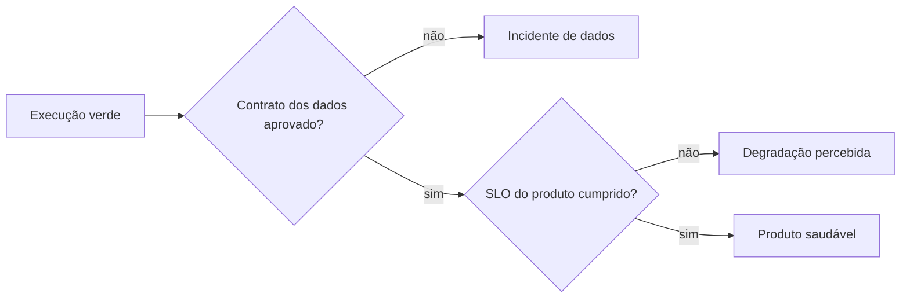

# Saúde Operacional e Observabilidade dos Dados

Saúde operacional cobre execução, recursos e dependências. Saúde dos dados cobre se o produto chegou, está completo, válido e coerente para consumo. As duas perspectivas podem divergir.

## Sinais dos dados

- freshness e atraso entre evento, ingestão e publicação;
- volume, bytes, contagem e continuidade de partições;
- completude, validade, integridade e unicidade;
- schema e compatibilidade;
- distribuição, cardinalidade e valores atípicos;
- reconciliação e uso pelos consumidores.

## Baseline e contexto

Anomalias estatísticas ajudam a detectar mudanças desconhecidas, mas precisam considerar sazonalidade, lançamentos e segmentos. Invariantes determinísticos continuam indispensáveis para regras críticas.

## Mudanças

Deploy, alteração de configuração, backfill e schema devem aparecer na mesma linha do tempo dos sinais. Mudança recente é uma pista, não prova de causalidade.

> [!warning]
> Um score agregado pode ocultar falha crítica. Preserve dimensões individuais e invariantes bloqueantes.

Para localizar propagação e impacto, use [[06-Linhagem-Dependencias-e-Analise-de-Impacto]].
