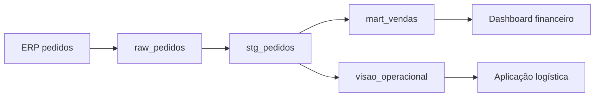

# Linhagem, Dependências e Análise de Impacto

Linhagem conecta fontes, transformações, datasets e consumidores. Dependência técnica mostra conexão; dependência operacional acrescenta versão, partição, run e estado efetivamente executados.

## Análise upstream e downstream

Upstream ajuda a procurar causas e mudanças de origem. Downstream identifica produtos, equipes e decisões afetadas. A travessia deve considerar tempo: uma tabela pode depender de uma versão antiga, não da execução mais recente.

## Granularidade

Linhagem por sistema é barata e ampla; por dataset é útil para impacto; por coluna explica propagação semântica; por registro costuma ser cara e reservada a requisitos específicos. Escolha segundo risco e pergunta.

## Correlação operacional

Associe nós e arestas a `run_id`, partição, código, schema e qualidade. Assim, um alerta de freshness pode localizar a tarefa lenta e enumerar consumidores dentro do SLO afetado.

> [!note]
> Linhagem declarada mostra intenção; linhagem capturada em execução mostra comportamento. Compare ambas para detectar caminhos inesperados.

Impacto orienta os objetivos de [[07-SLIs-SLOs-Alertas-e-Dashboards]].
