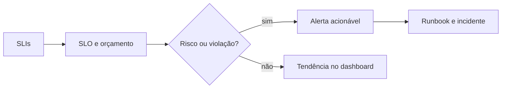

# SLIs, SLOs, Alertas e Dashboards

SLI é uma medida de comportamento; SLO é a meta para uma janela; SLA é um compromisso formal com consequências. Bons SLIs representam a experiência do consumidor e podem ser calculados de forma confiável.

```text
SLI_freshness = partições publicadas no prazo / partições esperadas
SLO_freshness = 99,5% em 30 dias
```

## Orçamento de erro

O orçamento corresponde à parcela de falha tolerada. Queimá-lo rapidamente sinaliza risco antes do fim da janela e orienta equilíbrio entre mudanças e confiabilidade.

## Alertas

Alertas devem indicar impacto, urgência, owner e ação. Combine janelas para evitar reação a ruído curto e detecção tardia de degradação persistente. Deduplicação e agrupamento reduzem tempestades causadas por uma única falha upstream.

## Dashboards

Dashboards executivos mostram SLO, risco e tendência. Operacionais mostram fila, duração, erro e capacidade. Diagnósticos permitem decomposição por tarefa, partição, versão e dependência.



> [!tip]
> Alerte sobre sintomas próximos do usuário; use métricas internas para diagnóstico.

A ação operacional é detalhada em [[08-Incidentes-Runbooks-e-Postmortems]].
