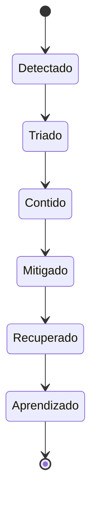

# Incidentes, Runbooks e Postmortems

Incidente é uma degradação com impacto que exige resposta coordenada. Severidade deve refletir alcance, criticidade, duração, exposição e possibilidade de correção, não apenas a causa técnica.

## Ciclo de resposta

Defina comandante, comunicação, investigação e execução. A prioridade inicial é reduzir impacto e preservar evidência. Atualizações devem declarar o conhecido, impacto, ação e próximo horário.

## Runbook

Um runbook contém sintomas, dashboards, consultas, hipóteses, ações seguras, rollback, escalonamento e validação. Ele precisa ser testado; comandos desatualizados aumentam o risco durante pressão.

## Postmortem

Registre linha do tempo, impacto, detecção, fatores contribuintes, resposta e ações. Evite culpa individual e “erro humano” como causa final. Ações precisam de owner, prazo e verificação de eficácia.

> [!warning]
> Restaurar o job sem validar os consumidores não encerra um incidente de dados. Pode ser necessário corrigir, republicar e comunicar o intervalo histórico.

Sustentabilidade é discutida em [[09-Arquitetura-Custo-Seguranca-e-Maturidade]].
