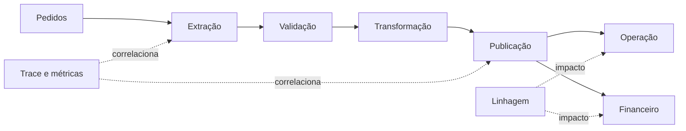

# Estudo de Caso — Observabilidade da DataRetail

A DataRetail S.A. recebia alertas separados do orquestrador, banco e dashboard. Em um atraso, cada sistema parecia saudável isoladamente e a equipe gastava horas correlacionando horários.

## Instrumentação

O fluxo passou a propagar `trace_id`, `run_id`, dataset, partição e versão. Spans representam extração, validação, transformação e publicação. Métricas medem duração, filas, freshness, completude e reconciliação. A linhagem conecta consumidores.

## Incidente

O SLO de cinco minutos disparou com freshness de oito minutos. O trace mostrou 240 segundos na transformação após mudança de plano de execução. Completude permaneceu em 99,5%, então não havia perda. A equipe limitou concorrência, restaurou a versão anterior e republicou a partição.

## Aprendizado

O postmortem adicionou teste de desempenho com distribuição representativa, alerta de queima rápida e anotação de deploy. A linhagem passou a anexar automaticamente Financeiro e Operação à comunicação do incidente.

> [!example]
> Nenhum sinal isolado explicou o incidente; a correlação entre SLO, trace, mudança e linhagem reduziu o diagnóstico.

Consolide em [[11-Resumo]].
